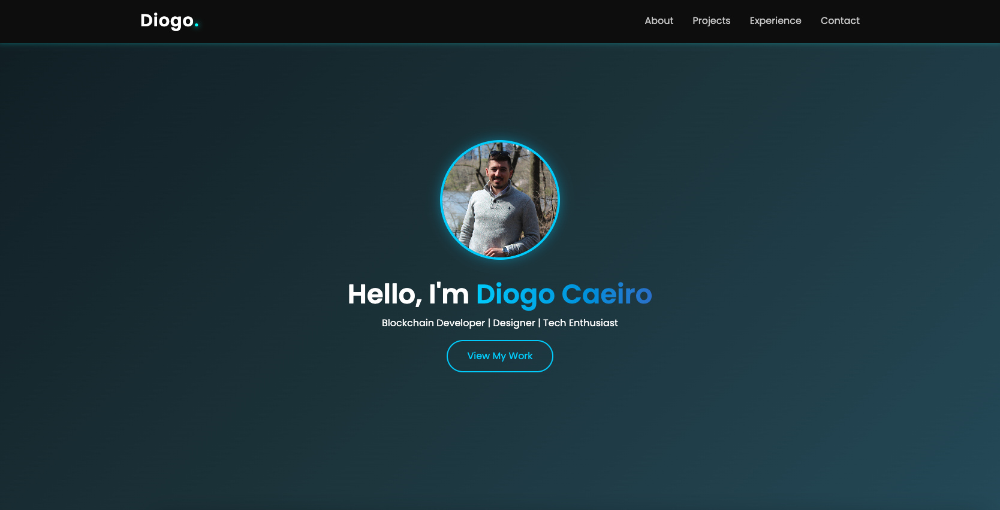

# 💻 Diogo Caeiro – Developer Portfolio

Welcome to my personal developer portfolio built with React. This project showcases my skills, projects, and experience as a blockchain developer, designer, and tech enthusiast. It’s designed to be fast, responsive, and modern — with a touch of futuristic style. 🌐✨

## 🚀 Live Site

🔗 [https://diogocaeiro.pt](https://diogocaeiro.pt)

---

## 📸 Preview



---

## 🛠️ Built With

- ⚛️ React (Create React App)
- 📦 EmailJS – Contact form integration
- 🍞 React Toastify – Notifications
- 🧭 React Router – Routing
- 🎨 CSS3 with custom animations
- 🌀 Framer Motion & AOS (optional effects)
- 📦 Vercel – Deployment
- ✨ Custom SEO/Open Graph meta tags

---

## 📁 Folder Structure

```
src/ │
     ├── components/
     │          ├── About/
     │          ├── Contact/
     │          ├── Experience/
     │          ├── Footer/
     │          ├── Hero/
     │          ├── NavBar/
     │          ├── NotFound/
     │          ├── Projects/
     │          └── TechStackSlider/
     │
     ├── data/
     │      ├── experience.json
     │      └── projects.json
     │
     ├── App.js
     ├── index.js
     └── App.css / index.css
```

---

## 🚀 How to Run Locally

### 1. **Clone** the Repository

```bash
git clone https://github.com/diogocaeiro02/diogocaeiro02.github.io.git
cd diogocaeiro02.github.io
```

### 2. Install Dependencies

```
npm install

```

### 3. Add Environment Variables

Create a .env file in the root:

```
REACT_APP_EMAILJS_SERVICE_ID=your_service_id
REACT_APP_EMAILJS_TEMPLATE_ID=your_template_id
REACT_APP_EMAILJS_PUBLIC_KEY=your_public_key
```

### 4. Start Development Server

```
npm start
```

### ✉️ Contact Form via EmailJS

This project uses EmailJS to handle messages from the contact form.

✅ No backend needed
📨 Email is sent to your inbox using their SDK
📂 Config is safely stored in .env

### 🌐 SEO Optimized

Custom <title> and <meta> tags

Open Graph and Twitter Cards

Canonical URL

Mobile-first design

### 📦 Deployment

This project is deployed on Vercel.

For SPA behavior and 404 fallback:

```
// vercel.json
{
  "rewrites": [
    { "source": "/(.*)", "destination": "/" }
  ]
}

```

## 🛠️ Credits

- Developed by [Diogo Caeiro](https://diogocaeiro.pt)
- SwiperJS used under MIT License.

### 📄 License

This project is open source and free to use for learning and inspiration.
Please credit Diogo Caeiro if you fork or clone.
